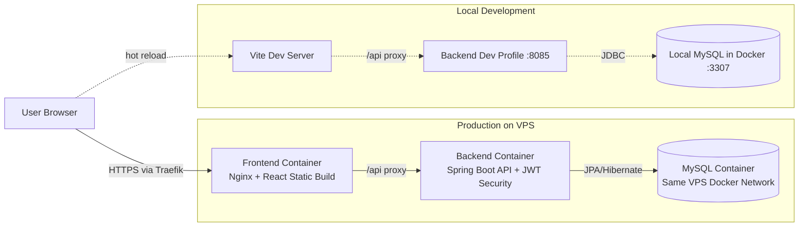
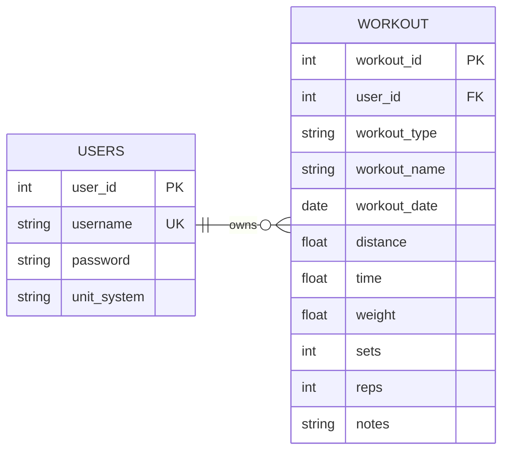

    

<strong>Fitness tracking and analytics app.</strong>

## About Momentum
I built Momentum to solve a personal problem: I wanted a clean, easy way to log workouts and visualize trends over time without paying another subscription provider.

## Website
- [momentum.tylerpac.dev](https://momentum.tylerpac.dev/) 

## Features
- User authentication and account management
- Workout logging and history tracking
- Data analytics and progress visualization
- RESTful endpoints for data operations
- Hibernate ORM for database management
- Separate MySQL database instance for isolation
- Containerized deployment with Docker
- Automated build and deployment pipeline with Jenkins

## Technology Stack
- **Backend:** Spring Boot (REST) + JPA
- **Frontend:** React + Vite
- **Database:** MySQL
- **Build Tool:** Maven
- **Containerization:** Docker, Docker Compose
- **CI/CD:** Jenkins

## Architecture

Momentum is a containerized full-stack app with a React frontend, Spring Boot backend, and MySQL persistence layer.

### System Architecture

### Database Relationship Diagram

## Contact

**Let's Connect**

For collaboration, engineering opportunities, or project discussions, use the contact page:

- [Contact TylerPac Development](https://www.tylerpac.dev/contact)